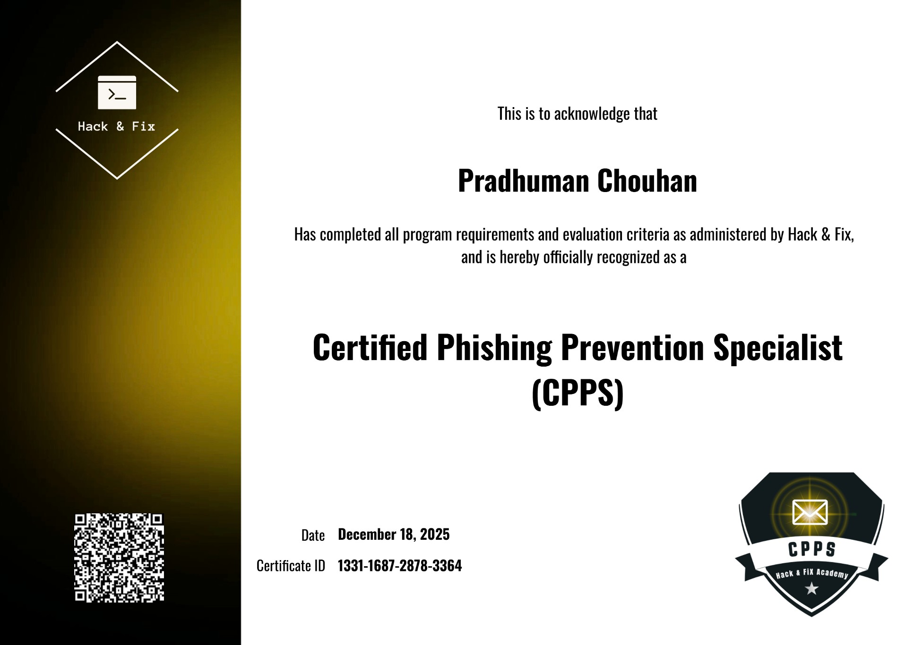

# 🔐 Cybersecurity Certifications Portfolio

Hi, I'm **Pradhuman Singh Chouhan** — a cybersecurity enthusiast focused on building practical skills in **SOC operations, threat detection, and network security**.

This repository showcases my certifications and hands-on learning journey in cybersecurity.

---

## 🧾 Certifications

### 🥇 EC-Council Certifications

* **Certified Secure Computer User (CSCU)**
  📅 Issued: May 2025
  🔗 [View Certificate]()

* **EC-Council Certified Security Specialist (ECSS)**
  📅 Issued: December 2025
  🔗 [View Certificate]()

---

### 🎯 Specialized Certifications

* **Certified Phishing Prevention Specialist (CPPS)**
  🔗 [View Certificate]()

---

### 🛠️ Technical Training

* **Ethical Hacking – MyCaptain**
* **Nmap Network Scanning – Udemy**

---

### 💼 Job Simulations (Forage)

* Cyber Job Simulation – Deloitte
* Cybersecurity Analyst Simulation

---

## 🏆 Achievements & Recognition

* Recommendation Letter – MyCaptain
* Appreciation Letter – MyCaptain

---

## 🧠 Skills Demonstrated

* Network Security
* Threat Detection
* Log Analysis
* Vulnerability Assessment
* SIEM Basics
* Wireshark & Nmap

---

## 🎯 Career Focus

Aspiring **SOC Analyst / Cybersecurity Analyst**, with hands-on exposure to real-world tools and simulations.

---

## 📌 Note

All certifications are verifiable via links or supporting documents in this repository.

---

## 🔗 Connect With Me

* LinkedIn: (Add link)
* Portfolio: (Add later)
